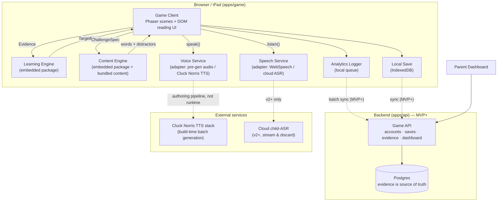

# ReadQuest — Technical Architecture v1

**Product:** ReadQuest (working title) · repo *WORDCRAFT-REALMS* · "The reading game that hears your child read."
**Companion docs:** [Game Roadmap v2](GAME-ROADMAP.md) (what we're building and why) · [Phase 1 Build Plan](PHASE-1-BUILD-PLAN.md) (what we build first).

This document defines the architecture for the entire roadmap (SLICE → BEYOND) at a level concrete enough to start the vertical slice immediately. Its single most important job, per the brief: **the game world, the reading/mastery engine, the TTS system, and the microphone/speech system are separate modules with typed contracts from day one.** Everything else here exists to make that separation real rather than aspirational.

---

## 1. Architectural principles

Each principle traces to the roadmap's Five Pillars (§2) and the brief's architecture section.

1. **Pedagogy never lives in game code; rendering never lives in engine code.** The game asks *"give me the next reading challenge for this context"*; the Learning Engine decides *what skill*, the Content Engine decides *which words*, and the game decides how it looks, sounds, and feels. Evidence flows game → engine; targets flow engine → game. Nothing else crosses the boundary.
2. **The iron rule is enforced by tooling, not discipline.** Every string a child can see lives in content files, never in code, and passes the decodability validator at build time. CI fails on a violation. ("A child is never shown a word containing sounds they haven't been taught" — roadmap §6.)
3. **Voice and speech are adapters behind stable interfaces.** `speak()` and `listen()` are the only doors. Swapping the Cluck Norris TTS stack ↔ pre-generated audio ↔ a cloud voice, or Web Speech ↔ cloud child-ASR ↔ on-device model, never touches game or engine code. This is what makes the v1→v2→v3 voice roadmap (roadmap §16) shippable incrementally.
4. **The mic can never block, by construction.** `listen()` only reports; the interaction layer owns the two-miss-and-open rule; every mic moment has a working no-mic fallback path. A speech adapter is physically unable to gate progress.
5. **Privacy by design.** Speech adapters return results, never audio — the interface has no method that exposes or persists a recording. Child profiles are pseudonymous; the parent account holds all PII. "We never store your child's voice" is an API-shape guarantee, not a policy promise.
6. **Local-first.** The game is playable with intermittent network. Saves and evidence append locally and sync when a backend exists. The slice runs with no backend at all.
7. **Pure core, thin shell.** `learning-engine` and `content` are pure TypeScript packages — no DOM, no Phaser, no network. They run identically in the browser, in Node, and in tests, and they are deterministic (seeded RNG) so every adaptive decision is replayable and auditable.

---

## 2. Stack decision

**Recommendation: TypeScript everywhere. Browser-first 2D client on Phaser 3 + Vite. Static hosting for the slice. Node (Fastify) + Postgres backend from MVP. Capacitor wrapper for the iPad app at LAUNCH.**

This is Option A from the brief (§77), chosen deliberately:

| Factor | Why it points to web/TS |
|---|---|
| Playtest loop | The slice gate is real children playing within 3 weeks. A URL on an iPad beats any install/build pipeline. Every push produces a playable link. |
| Device strategy | Desktop browser, iPad, iPhone, Android tablet (brief §39) are all one deployment. Capacitor wraps the same code for the App Store at LAUNCH. |
| Voice & mic | TTS audio playback, `getUserMedia`, and `SpeechRecognition` are native browser APIs; no plugin layer. |
| Existing assets | The Cluck Norris audio stack and the team's web experience transfer directly. One language across client, engines, content tooling, and server means the learning engine literally runs on both sides. |
| Text rendering | This is a *text* game. DOM/CSS text beats canvas text for crispness, dyslexia-font swaps, sizing, and highlighting (see §5.1's overlay strategy). |
| Scope honesty | A polished 2D world is explicitly preferred over voxel 3D ("the educational engine matters more than voxel graphics"). Phaser 3 is the most battle-tested 2D web engine: scenes, tilemaps, sprites, input, tweens, camera out of the box. |

**Why not Unity/Godot:** install friction kills the weekly kid-playtest loop; mic/TTS web APIs would go through plugin layers; team experience is web; nothing in the 9-biome roadmap requires 3D. **Escape hatch:** because the learning/content/voice/speech packages are pure TS with zero Phaser imports, a future client rewrite (Godot, Unity, 3D) replaces only `apps/game` and re-consumes every engine unchanged. That is the flexibility the module boundaries buy.

Supporting choices: **Vite** (dev server/build), **Vitest** (tests), **pnpm workspaces** (monorepo), **Zod** (runtime validation of content files and API payloads), **Fastify + Postgres** (MVP backend), **GitHub Actions** (CI: typecheck, tests, content validation, deploy preview).

---

## 3. System overview



Two things to notice: in the slice, **everything inside the Client box is the whole product** (dashed lines don't exist yet), and the TTS stack is a **build-time** dependency (audio is pre-generated per content line), not a runtime service — which makes the slice fully offline-capable after first load and immune to TTS latency.

---

## 4. Monorepo layout and dependency rules

```
wordcraft-realms/
├── apps/
│   ├── game/               # Phaser client + DOM reading UI + parent screen (slice: a route)
│   ├── api/                # Fastify backend (MVP+; empty placeholder until then)
│   └── parent/             # Standalone parent dashboard app (RETENTION+; a game route before that)
├── packages/
│   ├── shared/             # Types, contracts, IDs, event schemas. Depends on nothing.
│   ├── learning-engine/    # Mastery, selection, spaced repetition. Pure TS.
│   ├── content/            # Curriculum + word/line/quest data, query API, decodability validator
│   ├── voice/              # VoiceService interface + adapters (pregen, cluck-norris, webspeech-dev)
│   ├── speech/             # SpeechService interface + adapters (webspeech, cloud, ondevice) + matcher
│   └── analytics/          # Event taxonomy, local queue, batch uploader
├── tools/
│   ├── content-cli/        # validate · audio-gen · align · pack  (runs in CI)
│   └── playtest-kit/       # observation sheets, data export helpers
└── docs/                   # this document, roadmap, build plan
```

**Dependency direction (enforced with ESLint `no-restricted-imports` in CI):**

```
shared  ←  learning-engine, content, voice, speech, analytics  ←  apps/game, apps/api
```

- `learning-engine`, `content`, `voice`, `speech` may import **only** `shared`. Never each other, never Phaser, never DOM types (voice/speech adapters use browser APIs behind their interface, but expose none of it).
- `apps/game` composes everything but implements no pedagogy, no word selection, no ASR/TTS vendor calls.
- `apps/api` reuses `learning-engine` + `shared` to replay evidence server-side — same code, same numbers as the client.

---

## 5. Module specifications

### 5.1 Game Client (`apps/game`)

**Owns:** rendering, input, world simulation, quest/interaction flow, building, companion behavior, save orchestration, juice (celebrations, particles, audio ducking).
**Must not:** choose target skills or words, compute mastery, call TTS/ASR vendors directly, contain child-visible strings (all text comes from `content` by ID).

Structure:

- **Two rendering layers.** The world (tilemaps, sprites, camera) is Phaser/WebGL canvas. **All reading surfaces — word cards, dialogue text, signs zoomed, spellbook, menus — are a DOM overlay** positioned over the canvas. Rationale: pixel-crisp text at any size, per-word `<span>` highlighting driven by `SpeakHandle.onWordBoundary`, instant dyslexia-font/text-size/contrast swaps from the settings object (roadmap §19), and future screen-reader hooks. Canvas text is reserved for incidental world labels.
- **Scenes:** `Boot` → `CharacterSelect` → `Village` / `ForestEdge` / `Cave` (one scene class per map) + `BuildMode` overlay + persistent `HUD`.
- **Reading Moments as reusable widgets.** Each interaction type from roadmap §7 is one self-contained component with a uniform lifecycle (`present → attempt(s) → resolve → emit Evidence`): `SignRead`, `PathChoice`, `WordMatch`, `MagicWordDoor`, `NarratedDialogue`, later `BlendingForge`, `SentenceReadAloud`, `SpellCast`. Quests compose these by ID; new interaction types never require touching quest code.
- **The hint ladder** (roadmap §7: highlight grapheme → play sound → split → slow blend → full word) is one shared component used by every widget; hint depth reached goes into the Evidence record.
- **The two-miss rule lives here** (in `MagicWordDoor` and every future mic widget): 2 unmatched attempts → the door opens anyway, celebration slightly gentler, `Evidence{correct:false, micUsed:true}` recorded, `mic_assist_open` analytics event emitted. Pillar 4 is client policy, deliberately not speech-service policy.
- **Quest system:** data-driven state machines defined in `content` (`quests.json`): steps reference map targets, dialogue line IDs, and Reading Moment specs. The client executes; it doesn't define.
- **Companion controller:** follow pathing, mood states, and the **celebration animation** triggered on every `Evidence{correct:true}` — flagged load-bearing in roadmap §9, treated as a first-class system, not polish.

### 5.2 Learning Engine (`packages/learning-engine`)

**Owns:** skill state, mastery scoring, adaptive selection, spaced repetition, scaffolding policy (audio-assist level per roadmap §7), placement state.
**Must not:** know about words (only skill IDs), render anything, perform I/O. Persistence is host-provided (client saves snapshots; server replays evidence).

Public API (full types in §6):

```ts
record(e: Evidence): void                    // the only input
mastery(id: SkillId): MasteryState
allMastery(): MasteryState[]
taughtSkills(): SkillId[]                    // the iron-rule input for Content Engine
nextTarget(req: TargetRequest): TargetPlan   // 70/20/10 selection (MVP+; slice uses authored order)
scaffolding(): ScaffoldingPolicy             // auto-read | delayed-button | on-request
dueReviews(now: number): SkillId[]           // spaced repetition queue (RETENTION+)
snapshot(): EngineSnapshot                   // serialize; rebuildable by replaying evidence
```

**Mastery model v1** (deliberately simple, tunable, and replayable):

- Per skill: `score 0–100`, `confidence 0–1` (grows with evidence count and recency), attempt counters, `lastSeenAt`, `nextReviewAt`.
- Bands follow the brief: 0–20 new · 21–40 learning · 41–60 developing · 61–80 proficient · 81–100 mastered. Child-facing surfaces never show these; parent dashboard shows band words only.
- Update rule: exponential move toward the observed outcome.
  `weight = production ? 2.0 : 1.0` (pillar: production beats recognition) · `hintCredit = max(0, 1 − 0.25·hintsUsed)` · `observed = correct ? 100·hintCredit : 0` · `score += min(0.4, 0.15·weight) · (observed − score)`.
- **"Taught" is a curriculum event, not a score.** Skills become *taught* when their introduction moment plays (or via placement); the taught set is what feeds the decodability rule. Mastery says how well; taught says whether visible at all.
- **Selection (MVP+):** roll the 70/20/10 bucket (comfort = proficient+ not due · stretch = learning/developing or due reviews · new = next untaught skill in curriculum order), then constraints: never the same target skill twice consecutively (unless remediation), distractors drawn from the target word's curated confusable set filtered to taught skills, presentation order from seeded shuffle, **seed logged in Evidence** so any session is exactly reproducible.
- **Spaced repetition (RETENTION+):** on reaching mastered with confidence ≥ 0.5 → review at 2d, doubling to 32d cap; a failed review subtracts 15 points, resets the interval, and re-enters the stretch bucket. Decay is *scheduling*, not silent score rot — parents never see a skill "go backwards" without a visible cause.
- **Slice behavior:** `record()` and mastery math fully live (the parent screen and playtest analysis need them); `nextTarget()` returns the authored quest sequence. Adaptive selection switches on at MVP without touching game code — same interface, different internals.

### 5.3 Content Engine (`packages/content`)

**Owns:** the curriculum sequence, word/sentence/line/quest/book databases, query API, challenge assembly, and the **decodability validator** — the single enforcement point of the iron rule.
**Must not:** know about mastery scores (it receives taught-skill sets as input), render, or fetch.

**Content is data in the repo**, authored as JSON validated by Zod schemas:

- `curriculum.json` — the ordered grapheme/skill sequence (UFLI-style ordering per roadmap §6, encoded as data so pedagogy changes are content PRs, not code changes). Each entry: `skillId`, prerequisites, introduction line IDs, the biome gate it belongs to.
- `words.json` — per word: `id, text, graphemes[], phonemes[], skills[], syllables, pos, imageId?, audioId, confusables[]` (curated distractor sets — HEN/HAT/HOP style — because good distractors are pedagogy, not randomness).
- `lines.json` — every child-visible string: `id, text, speaker, gate (curriculum position), audioId, wordTimings[]`. Signs, dialogue, clues, UI prompts, celebration barks — everything.
- `quests.json` — quest state machines referencing line IDs and Reading Moment specs.
- `books.json` (MVP+) — paged decodable books with per-page lines.

API: `word(id)` · `queryWords({withinSkills, requireSkill?, excludeIds?, count})` · `buildChallenge(spec) → {target, distractors, presentationOrder}` · `line(id)` · `validate(text, taughtSkills) → DecodabilityReport`.

**The validator** (runs in `content-cli` at build time, and at runtime for dynamic text later): tokenize → every token must resolve to a `words.json` entry or the taught heart-word list → `skills(word) ⊆ taughtAtGate`. Unknown word = build failure (no unregistered text can ship). Character/world names in child-visible text must themselves be decodable at their gate — the roadmap already does this (Rex, Ash, Chip, Dash, Hen); "Lexia" and any non-decodable proper noun stay in narrator *audio* only until taught.

**Dynamic stories (BEYOND)** run the same validator at generation time server-side: the generator proposes, the validator disposes. AI never bypasses the iron rule (brief §34).

### 5.4 Voice Service (`packages/voice`)

**Owns:** all audio *output* of speech: narration, word pronunciation, phoneme sounds, slow blends.
**Interface:** `speak(req) → SpeakHandle` (word-boundary events + end event + stop), `preload(ids)`. That's the whole surface, per the brief's `speak(text, voice, speed)` directive.

Adapters, in order of use:

1. **`PregenAudioAdapter` (primary, slice→LAUNCH).** All authored content is batch-generated at build time by `content-cli audio-gen` calling the **Cluck Norris TTS stack**, one clip per line/word/phoneme ID, mp3 mono ~48kbps, shipped as static assets with a timings sidecar. Runtime "TTS" is just playback + timed highlight events: zero latency, zero runtime cost, works offline. Word timings come from the TTS stack if it provides marks, else from forced alignment in the pipeline (§8).
2. **`CluckNorrisRuntimeAdapter` (BEYOND).** Live TTS for dynamic stories. The seam to specify during the week-1 audit (§16): batch API? voices? SSML/rate control? word-boundary marks? latency? licensing?
3. **`WebSpeechSynthesisAdapter` (dev-only).** `speechSynthesis` fallback so development never blocks on the audio pipeline. Never ships to kids (quality).

**Scaffolding execution:** the audio-fade ladder (auto-read → delayed button → on-request, roadmap §7) is a `ScaffoldingPolicy` owned by the Learning Engine; the dialogue widget executes it and records `audioRequested` in Evidence. Voice Service itself is policy-free.

### 5.5 Speech Recognition Service (`packages/speech`)

**Owns:** all audio *input*: mic capture, recognition, and the forgiving matcher.
**Interface:**

```ts
available(): Promise<AvailabilityReport>       // engine support + permission state
listen(req: ListenRequest): Promise<ListenResult>   // one attempt; resolves always (timeout built in)
```

There is deliberately **no** method that returns, stores, or forwards raw audio. Adapters own the buffer for the duration of the call and drop it. This is principle 5 made structural.

**The closed-set insight that makes v1 viable:** we never need open transcription. We always know the expected word. The question is "did this utterance ≈ SHIP?" — a closed-set match that weak ASR handles far better than dictation, and that tolerates missing teeth, accents, and noise (brief §14):

- Normalize recognized text (case, punctuation, common homophone map).
- Match against `expected` ∪ its curated accept-set, scored by phoneme-level edit distance (Double Metaphone-style keys + distance threshold).
- **Bias policy: false-accept is pedagogically fine; false-reject is the product killer.** Thresholds tune generous. A miss is never announced as wrong — the widget plays the hint ladder and re-invites ("Almost! Listen: shhh…").
- Near-miss detail (`recognized:"sip"` vs `expected:"ship"`) is preserved in Evidence — it becomes the v3 speech-error-classification signal (brief §42) with zero schema change later.

Adapters: **`WebSpeechAdapter` (v1)** — browser `SpeechRecognition` (Chrome, iPad Safari 14.5+); spike its child-voice behavior in week 1. **`CloudChildASRAdapter` (v2)** — server-relayed streaming ASR tuned for children; stream in, discard audio, return result; server stores nothing. **`OnDeviceAdapter` (option)** — WASM model if offline mic becomes a requirement. **`NullAdapter`** — unsupported/denied environments: `listen()` resolves `{status:'unsupported'}` immediately and the widget runs its no-mic ritual ("Say it out loud… now tap the word!"), logged as unverified production. The game is fully playable with the mic entirely absent — pillar 4 again.

**Permission flow (brief §40):** mic features exist only when the parent setting is on; OS permission is requested on first parent-enabled use with the "ReadQuest can listen while your child practices reading" explainer; every listening moment shows the 🎤 indicator; capture hard-stops at `timeoutMs`.

### 5.6 Game API (`apps/api` — MVP+)

**Owns:** parent accounts (email + password/OAuth, consent records), child profiles, save sync, evidence ingest, dashboard queries, purchases (LAUNCH).
Fastify + Postgres, versioned REST:

```
POST /v1/auth/…                              # parent only; children never have credentials
GET/POST /v1/children                        # profiles: display name/avatar/settings only
POST /v1/children/:id/evidence               # append-only batch, idempotent by client event id
PUT  /v1/children/:id/save                   # versioned save blob; server keeps history
GET  /v1/children/:id/mastery                # server-side replay of the same learning-engine
GET  /v1/children/:id/dashboard              # parent view aggregates
```

**Sync model — the reason this stays simple:** the append-only **evidence log is the source of truth**; mastery is a projection computed by the *same* `learning-engine` package on the server. Client/server sync is log union by event ID (order-tolerant, retry-safe, offline-friendly); projections are rebuildable at any time, including after tuning the mastery formula. Save blobs (world/inventory/building) sync last-write-wins with server-kept history — losing a wall placement is acceptable; losing reading evidence is not.

### 5.7 Analytics (`packages/analytics`)

Event taxonomy from brief §73 (`quest_started/completed`, `challenge_attempted`, `hint_used`, `audio_requested`, `mic_attempted`, `mic_assist_open`, `item_crafted`, `pet_interaction`, `session_start/end`, `quit_point`) with the reading-evidence record (§74 fields) as its richest event. Local ring buffer → JSON export button in the slice (playtest analysis) → batched upload at MVP. No third-party analytics SDKs in the child app; events are pseudonymous (childId, no PII).

### 5.8 Parent experience

Slice: one screen inside `apps/game` behind a "grown-ups" gate (hold-to-open + simple arithmetic), reading directly from local mastery + evidence: minutes played, reading interactions, words read independently vs with hints, skill list with band words, data export. MVP+: served from `apps/api` aggregates; RETENTION: standalone `apps/parent` with the roadmap §17 feature set (weekly suggestion, controls for time/audio/mic/difficulty/privacy). The privacy headline — *"We never store your child's voice"* — renders here from day one.

---

## 6. Core contracts (`packages/shared`)

The day-one seam definitions. Everything in §5 speaks these types; they are the API-stability boundary between teams/sessions working on different modules.

```ts
// ── Identity ──────────────────────────────────────────────
type SkillId = string;   // 'short_a' | 'digraph_sh' | 'heart_said' | ...
type WordId  = string;   // 'w_ship'
type LineId  = string;   // 'ln_mayor_intro_01'
type ChildId = string;   // pseudonymous

type ChallengeType =
  | 'sign_read' | 'path_choice' | 'word_match' | 'magic_word'
  | 'narrated_dialogue'                       // exposure; not counted as an interaction
  | 'blending_forge' | 'sentence_read' | 'spell_cast' | 'phoneme';  // later phases

// ── Evidence: the atomic record (brief §74) ───────────────
interface Evidence {
  eventId: string;                 // uuid; idempotency key for sync
  childId: ChildId;
  at: number;                      // epoch ms
  challengeType: ChallengeType;
  skillIds: SkillId[];             // exercised skills; [0] = target
  wordId?: WordId;
  lineId?: LineId;
  channel: 'recognition' | 'production';
  correct: boolean;
  attemptIndex: number;            // 1 = first try
  hintsUsed: number;               // hint-ladder depth reached
  audioRequested: boolean;
  micUsed: boolean;
  responseMs?: number;
  seed?: number;                   // presentation shuffle seed (reproducibility)
  speech?: { expected: string; recognized: string | null; confidence: number };
}

// ── Learning Engine ───────────────────────────────────────
interface MasteryState {
  skillId: SkillId;
  score: number;                   // 0–100
  confidence: number;              // 0–1
  band: 'new' | 'learning' | 'developing' | 'proficient' | 'mastered';
  attempts: number; correct: number;
  lastSeenAt?: number; nextReviewAt?: number;
  taught: boolean;
}

interface TargetRequest { childId: ChildId; hostableTypes: ChallengeType[]; }
interface TargetPlan {
  targetSkill: SkillId;
  bucket: 'comfort' | 'stretch' | 'new';
  taughtSkills: SkillId[];         // iron-rule input for content queries
  weaveReviews: SkillId[];         // due spaced-repetition skills
}

interface ScaffoldingPolicy { dialogueAudio: 'auto' | 'delayed_button' | 'on_request'; delayMs: number; }

// ── Content Engine ────────────────────────────────────────
interface Word {
  id: WordId; text: string;
  graphemes: string[]; phonemes: string[]; skills: SkillId[];
  syllables: number; pos?: string;
  imageId?: string; audioId: string;
  confusables: WordId[];           // curated distractors
}

interface Line {
  id: LineId; text: string; speaker: string;
  gate: SkillId;                   // curriculum position where this text may appear
  audioId: string;
  wordTimings: { word: string; startMs: number; endMs: number }[];
}

interface ChallengeSpec { type: ChallengeType; plan: TargetPlan; distractorCount: number; seed: number; }
interface ChallengeContent { target: Word; distractors: Word[]; presentationOrder: number[]; }

interface DecodabilityReport { ok: boolean; violations: { token: string; missingSkills: SkillId[] }[]; }

// ── Voice Service ─────────────────────────────────────────
interface SpeakRequest {
  lineId?: LineId; wordId?: WordId; phoneme?: string;   // authored content (pre-generated)
  text?: string;                                        // dynamic content (BEYOND; runtime TTS)
  voice: string;                                        // 'narrator' | 'wizard' | 'mayor_hen' | ...
  rate?: number;                                        // narration-speed setting; slow-blend uses this
}
interface SpeakHandle {
  onWordBoundary(cb: (wordIndex: number) => void): void;
  onEnd(cb: () => void): void;
  stop(): void;
}
interface VoiceService { speak(req: SpeakRequest): SpeakHandle; preload(ids: string[]): Promise<void>; }

// ── Speech Service ────────────────────────────────────────
interface ListenRequest { expected: string; acceptAlso?: string[]; timeoutMs: number; }
interface ListenResult {
  status: 'match' | 'no_match' | 'no_speech' | 'timeout'
        | 'permission_denied' | 'unsupported' | 'error';
  recognized: string | null;
  confidence: number;              // matcher confidence, not raw ASR confidence
  method: 'webspeech' | 'cloud' | 'ondevice' | 'none';
}
interface AvailabilityReport { supported: boolean; permission: 'granted' | 'denied' | 'undetermined'; }
interface SpeechService { available(): Promise<AvailabilityReport>; listen(req: ListenRequest): Promise<ListenResult>; }
```

---

## 7. Data model

### 7.1 Client save (slice onward)

One versioned JSON document per child profile in IndexedDB (`schemaVersion` + migration functions from day one):

```
save: { schemaVersion, childId, profile {displayName, avatarId, settings},
        world {scene, position, flags}, questState, inventory, buildings[],
        companion {name, species, level, xp}, currencies }
evidenceLog: append-only Evidence[]          // never truncated client-side in slice
engineSnapshot: EngineSnapshot               // cache; rebuildable from evidenceLog
```

### 7.2 Server (MVP+)

| Table | Key fields | Notes |
|---|---|---|
| `parent_accounts` | id, email, auth, consent_at, created_at | All PII lives here and only here |
| `child_profiles` | id, parent_id, display_name, avatar_id, settings jsonb | Pseudonymous; display name is the only quasi-PII, parent-entered |
| `reading_attempts` | id (client eventId), child_id, at, payload jsonb | **Append-only source of truth**; mirrors `Evidence` |
| `skill_mastery` | child_id, skill_id, score, confidence, band, next_review_at | Projection; rebuilt by replaying attempts through `learning-engine` |
| `game_saves` | child_id, version, payload jsonb, updated_at | Last-write-wins, history retained |
| `analytics_events` | id, child_id, type, at, payload jsonb | Gameplay funnel events |

---

## 8. Content & audio pipeline

```
author JSON ──► content-cli validate ──► content-cli audio-gen ──► content-cli align ──► content-cli pack
   (repo PR)     schema + iron rule        Cluck Norris TTS batch     word timings          hashed static
                 + confusable sanity       one clip per line/word     (TTS marks, else      assets + manifest
                 + audio coverage          /phoneme/slow-blend         forced alignment,
                                                                      else manual tap-tool)
```

- Validation runs in CI on every PR; **a decodability violation or a line without audio fails the build.** The iron rule and the "everything narratable" rule are gates, not review comments.
- Word timings, in order of preference: timing marks from the TTS stack → forced alignment (aeneas/WhisperX) in the pipeline → the manual tap-along tool in `tools/content-cli` (a real fallback: the slice has only ~60 lines; one afternoon).
- Assets ship content-hashed with a manifest; the client pins a content version per session, enabling cache-forever headers and clean offline behavior (service worker precaches the current biome from MVP).
- Evolution cinematics (roadmap §9, RETENTION) are pre-rendered mp4s in the same asset pipeline, keyed by companion + milestone — a content-generation concern (Higgsfield), never a runtime dependency.

---

## 9. Cross-cutting concerns

**Child privacy (COPPA posture, brief §41).** Data inventory: parent PII in `parent_accounts` only; child = display name + avatar + pseudonymous IDs; speech = result records only (`{expected, recognized, confidence, result}`), raw audio structurally unstorable (§5.5); no ads, no third-party trackers, no behavioral advertising SDKs ever. Verifiable parental consent at account creation; data export + deletion per child profile from the parent dashboard.

**Accessibility (roadmap §19).** One `settings` object read by every renderer: `font ('default'|'dyslexic')`, `textScale`, `contrast`, `reducedMotion`, `narrationRate`, `untimed`, `extraRepetition`. The DOM reading layer makes the text-related settings nearly free; they exist in the schema from the slice even where the UI arrives later. Framed in parent UI as preferences, never deficiencies.

**Offline (brief §81).** Slice: fully offline after load (bundled audio, local save, no backend). MVP+: service-worker precache of current-biome content; evidence/analytics queue locally and flush on reconnect; the only hard-online features are account sync and (later) live ASR — and the mic ritual fallback covers even that.

**Determinism & testability.** Engines are pure and seeded: golden tests replay recorded evidence streams and assert mastery trajectories; selection tests assert the 70/20/10 distribution and anti-guessing constraints (brief §75) over thousands of seeded draws; validator tests pin the iron rule with fixture corpora.

**Observability.** Client error reporting (Sentry or similar) with PII scrubbing and no session replay in the child app; content version + adapter choices attached to every report; feature flags (simple JSON config) gate phase rollouts per §15.

---

## 10. Phase map (what each module ships when)

| Module | SLICE "Magic Door" | MVP "Woods Complete" | RETENTION "Dragon Grows" | LAUNCH | BEYOND |
|---|---|---|---|---|---|
| Game client | Village+forest+cave, 4 widgets, quest FSM, build plot, dragon follow/celebrate/level | Shop, crafting, spellbook (2 spells), library UI, cave sub-area | Biome 2, boss framework, evolution cinematics, blueprint economy | Biomes 3–4, world events, iPad wrapper (Capacitor), subscription gate | Biomes 5–9, multiplayer (preset comms), minigame suite |
| Learning engine | Evidence + mastery live; authored sequencing; scaffolding policy | **70/20/10 adaptive live** | Spaced repetition; placement adventure | Tuning at scale | Speech-error-driven instruction |
| Content engine | ~150-word corpus, validator in CI, quests/lines as data | 300–500 words, 3 decodable books | Biome-2 corpus (blends), books+ | Biomes 3–4 corpora | Dynamic stories through the same validator |
| Voice | Pre-gen audio + timings, highlight events | More voices/characters | — | — | Runtime TTS for dynamic stories |
| Speech | WebSpeech adapter + forgiving matcher + two-miss + no-mic ritual | Tuning from playtest data | **v2 cloud child-ASR; sentence read-aloud** (skip/substitution detection) | Scale + cost tuning | **v3 phoneme analysis; semi-open NPC answers** |
| API/backend | none (local-first) | Accounts, profiles, evidence ingest, save sync, dashboard v1 | Dashboard v2, weekly suggestions | Subscriptions/entitlements | Teacher mode, classrooms |
| Analytics/parent | Local log + export + one-screen parent view | Server aggregates | Funnel + retention analysis | Growth metrics | Teacher reporting |

---

## 11. Risks & open questions (architecture-level)

| # | Risk / question | Mitigation / action |
|---|---|---|
| 1 | **Cluck Norris TTS capabilities unknown to this repo** — batch API? voices? rate control (slow blends)? word-boundary marks? licensing for shipped audio? | Week-1 audit against the §5.4 adapter contract. Pipeline already assumes no timing marks (alignment fallback). If batch generation is impossible, any quality TTS can fill the slice behind the same adapter. |
| 2 | **Web Speech API behavior on child voices, esp. iPad Safari** (availability, accuracy, network dependence in Chrome). | Week-1 spike with recorded child utterances of the slice's magic words. Closed-set matcher + generous thresholds designed for weak ASR. Fallback ladder ends at the no-mic ritual — the slice gate ("zero stuck-mic moments") is achievable even if ASR disappoints. |
| 3 | Phaser + DOM overlay interaction complexity (input routing, z-order, iPad Safari quirks). | Standard pattern; prove in M0 scaffold with one dialogue box before building all widgets. |
| 4 | Future 3D ambition vs 2D engine choice. | Accepted trade for playtest speed; pure-TS engines make the client swappable (§2 escape hatch). |
| 5 | Mastery formula v1 is heuristic. | Encapsulated in one module; evidence log is source of truth, so projections can be recomputed under any future model (including BKT/IRT) without data loss. |
| 6 | Content authoring throughput (every word tagged, every line gated + voiced). | `content-cli` scaffolding + Zod schemas catch errors early; corpus sizes per phase are deliberately small (150 → 500). |

---

## 12. What to build first

The [Phase 1 Build Plan](PHASE-1-BUILD-PLAN.md) turns this architecture into a 3-week, milestone-gated build of the SLICE — "The Magic Door" — including the week-1 spikes that retire risks #1–#3 above.
